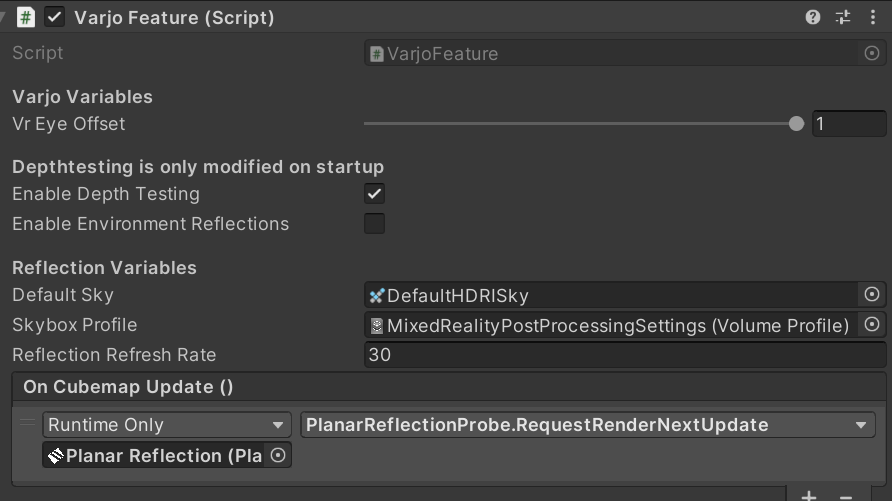

## DeviceManager Script

The deviceManager stores the selected headset and checks, if there is any controller offset that needs to be covered. This script could be used for external scripts to access the current headset.

### How to switch between headsets
To make sure the transition goes well, make sure that there is no headset running (plugged off the computer/electricity) and SteamVR and/or Varjo Base are closed. Then, go to Project Settings under XR Plug-in Management and check the needed SDK for your device. Even if that might not change a lot: Make sure to first uncheck the already ticked checkbox first.

- <bold>Vive</bold>: First, go to SteamVR -> Settings -> Developer -> Set SteamVR as OpenXR runtime. Inside Unity, set the runtime to OpenXR. Notice that everytime you'll start another runtime (e.g Varjo) on your system, this setting might change on its own.
- <bold>Varjo</bold>: Make sure the runtime is set correctly and inside Unity, only the Varjo runtime is selected.
- <bold>Microsoft</bold>: Just like with Vive, inside DeviceManager.cs set the mode to "OpenXR" and follow [this](https://docs.microsoft.com/de-de/windows/mixed-reality/develop/unity/new-openxr-project-with-mrtk) guide.

#### Do not launch the program with both SDKs activated!

(The XR Plugin Management Tool loads the SDKs in alphabetically order. Though it is possible to change this order to e.g. always load the Varjo SDK first in order to support all the features, this can lead to unexpected behaviours and is not recommended.)

After, go to the deviceManager script and set the "Used Device" setting matching your headset and the already set SDK. Now you should be way to go! If needed, start SteamVR and/or Varjo Base and plug in your headset. If everything is running (and you didn't forget to re-connect your controllers), feel free to start the template!

## AR_VR_Toggle Script
Sets the environment-type and could be used by external scripts to change the environment during runtime. (Can also be used to change the environment for testing purposes during a live-preview.)
It's even possible to switch between AR and VR during runtime usind the "T" key.

## Controller Manager Script
This script makes sure that the controllers are setup correctly. It covers the controller offset between Varjo tracking and OpenXR tracking (Vive) as well as disabling the controllers when switching to AR mode.

## Load ARVR Objects to Mode Script
This script manages the display of objects related to the used display mode. You'll also find the option to turn the ground invisible (and act as a shadow catcher) with this script.

## XR Feature Manager Script
This script loads the specific device-feature scripts and functionality for the headsets depending on the selected environment-type (see AR_VR_Toggle) and device (see Device Manager).
If you want to extend the list of features, have a look at [this tutorial](CREATEFEATURE.md).

### Varjo Feature
Using HDRP, you should set your settings like the following picture:

There is a setting called Eye offset which is set to 1 by default (see noticable mentions). Notice that there are cases where in VR, 0 might be a better choice.